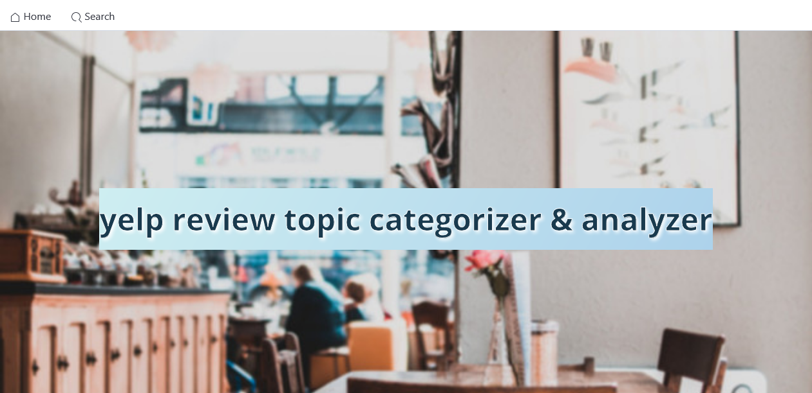
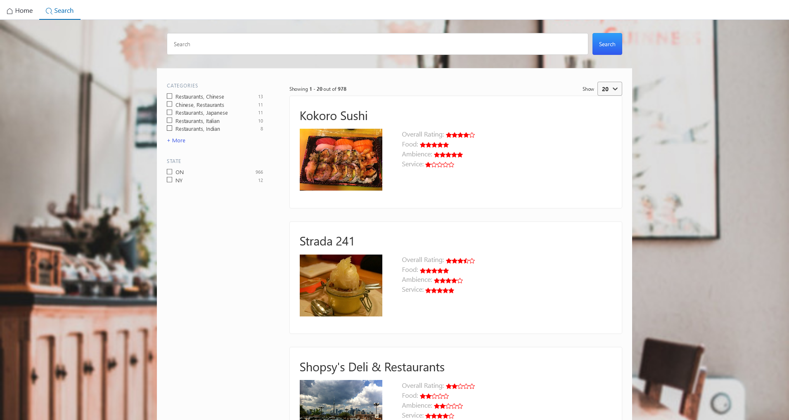

# Yelp Review Topic Categorizer and Analyzer

## Table of Contents
- [Overview](#overview)
- [Usage](#usage)
- [How To Run](#how-to-run)
- [Diagrams](#diagrams)
- [Dependencies](#dependencies)

## Overview
A business’s Yelp rating is based on a five star scale that is composed of an average of all user reviews on the business’s Yelp profile. This system gives users a quick and general overview of a business’s performance. However, this method poses a set of limitations. One limitation is how the numerical rating may not be indicative of the business’ actual quality. For example, a business might have a negative number review (1-5 star rating), but its text review might indicate that the service was good but the ambience gave the reviewer a negative experience. Another limitation comes from the user’s perspective in that Yelp does not accurately cater to the user’s query. For example, a user might look for a restaurant with a classy ambience, but Yelp’s results show all restaurants, even those that are not classy.

The Yelp Review Topic Categorizer and Analyzer does the following:

- Coming up with empirical analysis of Yelp reviews
- Helps you choose which restaurants to eat at based on scores of different topics

## Team
<a href="https://github.com/giuseppi" target="_blank">Giuseppi Pelayo </a>

<a href="https://github.com/TimothyKool" target="_blank">Timothy Koo </a>

<a href="https://github.com/dlscarmina" target="_blank">Mina delos Santos </a>

<a href="https://github.com/andrewrchen05" target="_blank">Andrew Chen </a>

## Usage
Demo: https://youtu.be/dsYeiRCCzcc

<Screenshot of application>

## How To Run

To be able to run this application, please clone this repository. After that, you will need to navigate to the correct directories to run both the client and server side.

In order for the Google Maps API to show the location of the restaurant, initialize your key in **[client/app-env](https://github.com/CS178A-B/final-project-cool-team/blob/master/client/app-env)** by replacing `YOUR_MAPS_API_KEY` with your own key.

To run the client side in one terminal, change directories into **[client](https://github.com/CS178A-B/final-project-cool-team/blob/master/client/)**. After that, run `npm install`, then run `npm start`.

To run the server side in another terminal, change directories into **[server](https://github.com/CS178A-B/final-project-cool-team/blob/master/client/)**. After that, run `npm install`, then run `npm start`.

### `npm install`

Installs node package dependencies for this project. (Dependencies may be found in package.json files)

### `npm start`

Runs the client and server in the development mode. 
This automatically opens [http://localhost:3000](http://localhost:3000) in your browser, where you can view the app.

The page will reload if you make edits. 
You will also see any lint errors in the console.

### `npm test`

Launches the test runner in the interactive watch mode. 
See the section about [running tests](https://facebook.github.io/create-react-app/docs/running-tests) for more information.

### `npm run build`

Builds the app for production to the `build` folder. 
It correctly bundles React in production mode and optimizes the build for the best performance.

The build is minified and the filenames include the hashes. 
Your app is ready to be deployed!

See the section about [deployment](https://facebook.github.io/create-react-app/docs/deployment) for more information.

### `npm run eject`

**Note: this is a one-way operation. Once you `eject`, you can’t go back!**

If you aren’t satisfied with the build tool and configuration choices, you can `eject` at any time. This command will remove the single build dependency from your project.

Instead, it will copy all the configuration files and the transitive dependencies (Webpack, Babel, ESLint, etc) right into your project so you have full control over them. All of the commands except `eject` will still work, but they will point to the copied scripts so you can tweak them. At this point you’re on your own.

You don’t have to ever use `eject`. The curated feature set is suitable for small and middle deployments, and you shouldn’t feel obligated to use this feature. However we understand that this tool wouldn’t be useful if you couldn’t customize it when you are ready for it.

## Diagrams

### Sequence Diagrams

 
Shown here is one of our sequence diagrams and an example of how our quintessential user, the Foodie, would interact with our service. The overview of this sequence diagram is how a Foodie requests the rank of restaurants based on a specific category, e.g ambience.

### Frontend Structure

 
The front-end begins with a landing page with an introduction to our application. The search page takes the input and determines whether the user is identifying either a location, restaurant, or cuisine and gathers the information for the relevant query from the analyzed database. This analyzed database is then displayed in a list which can be filtered.

### Overall System Diagram

 
The application begins with the Yelp Review Dataset which contains reviews for restaurants. These reviews go into a database to be cleaned and formatted for data analysis. A small set of these reviews are categorized manually, identifying which categories (food, service, ambience, health/safety) are relevant to the review. The cleaned data and the training model enters Google Cloud’s AutoML Natural Language where it categorizes all of the reviews and uses sentiment analysis to determine the holistic rating for each category per restaurant. This data is stored in MongoDB and used by the application's Express functions to access specific restaurant information. ElasticSearch creates a clean UI for the search page.

## Dependencies

Install [Node Package Manager](https://www.npmjs.com/get-npm). (More dependencies may be found in **[client/package.json](https://github.com/CS178A-B/final-project-cool-team/blob/master/client/package.json)** and **[server/package.json](https://github.com/CS178A-B/final-project-cool-team/blob/master/server/package.json)** files).
